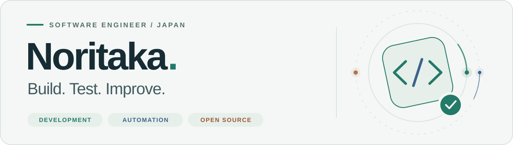

<!-- Profile banner: local assets with light and dark variants. -->
<picture>
  <source media="(prefers-color-scheme: dark)" srcset="assets/profile-header-dark.svg">
  <source media="(prefers-color-scheme: light)" srcset="assets/profile-header-light.svg">
  
</picture>

<h1 align="center">
  Hi, I'm Noritaka
  
</h1>

  <picture>
    <source media="(prefers-color-scheme: dark)" srcset="https://readme-typing-svg.demolab.com?font=Fira+Code&amp;weight=600&amp;size=22&amp;duration=2000&amp;pause=1000&amp;color=89DDC7&amp;center=true&amp;vCenter=true&amp;width=520&amp;height=52&amp;lines=Software+Engineer;Test+Engineer;OSS+Contributor">
    
  </picture>

  <strong>Software Engineer · Test Engineer · OSS Contributor</strong> 
  Building useful tools, improving software quality, and contributing to the projects I use.

  
  
  
  
  

  <a href="#about-me">About</a> &nbsp; / &nbsp;
  <a href="#vs-code-extensions">Extensions</a> &nbsp; / &nbsp;
  <a href="#tech-stack">Stack</a> &nbsp; / &nbsp;
  <a href="#oss-contributions">Open source</a>

---

## About Me

I'm a Japanese engineer working across web, mobile, test automation, and developer tooling.
I enjoy making everyday development smoother — through a useful extension, a reliable test, or a small OSS improvement.

- **What I work on** — software development, test engineering, CI, and developer experience.
- **What I'm exploring** — cloud platforms, backend frameworks, and mobile development with Kotlin and Gradle.
- **How I contribute** — bug fixes, tests, docs, maintenance, typing, and tooling.
- **Beyond code** — studying English to communicate better with global communities.

## VS Code Extensions

Small tools for everyday development and mobile testing.

<table>
  <tr>
    <td width="50%" valign="top">
      <h3>📦 npm-dependency-manager</h3>
      
Manage npm dependencies from your editor and make dependency maintenance part of your everyday workflow.

      
DEPENDENCIES · DEVELOPER TOOLS

      <a href="https://marketplace.visualstudio.com/items?itemName=noritaka1166.npm-dependency-manager">Marketplace ↗</a> &nbsp; · &nbsp;
      <a href="https://github.com/noritaka1166/vscode-npm-dependency-manager">Source ↗</a>
    </td>
    <td width="50%" valign="top">
      <h3>📋 path-copy</h3>
      
Copy file paths directly from your editor with a small, focused utility.

      
FILE PATHS · PRODUCTIVITY

      <a href="https://marketplace.visualstudio.com/items?itemName=noritaka1166.path-copy">Marketplace ↗</a> &nbsp; · &nbsp;
      <a href="https://github.com/noritaka1166/vscode-path-copy">Source ↗</a>
    </td>
  </tr>
  <tr>
    <td width="50%" valign="top">
      <h3>🔎 appium-inspector-bridge</h3>
      
Bring Appium Inspector closer to your development workflow.

      
APPIUM · MOBILE TESTING

      <a href="https://marketplace.visualstudio.com/items?itemName=noritaka1166.appium-inspector-bridge">Marketplace ↗</a> &nbsp; · &nbsp;
      <a href="https://github.com/noritaka1166/vscode-appium-inspector-bridge">Source ↗</a>
    </td>
    <td width="50%" valign="top">
      <h3>📱 mobile-emulator-manager</h3>
      
Manage mobile emulators from your editor for smoother mobile app testing.

      
MOBILE TOOLING · IN DEVELOPMENT

      <a href="https://marketplace.visualstudio.com/items?itemName=noritaka1166.mobile-emulator-manager">Marketplace ↗</a> &nbsp; · &nbsp;
      <a href="https://github.com/noritaka1166/vscode-mobile-emulator-manager">Source ↗</a>
    </td>
  </tr>
</table>

## Tech Stack

| Area | Tools & technologies |
| :--- | :--- |
| **Web & backend** | JavaScript, TypeScript, React, Node.js, Express, Java |
| **Testing & CI** | Jest, Selenium, Jenkins, GitHub, GitLab |
| **Data & development** | PostgreSQL, MySQL, Firebase, Git, Android Studio, VS Code, IntelliJ IDEA |
| **Learning next** | AWS, Azure, Google Cloud, Kotlin, Gradle, Spring |

  

<strong>🌱 What I'm learning next</strong>

  Exploring cloud platforms, backend frameworks, and mobile development.

  

## OSS Contributions

Small, practical improvements to projects I use and care about.
My contributions span mobile testing, JavaScript tooling, documentation, and developer experience.

  
  

<strong>Browse contributions by organization & repository</strong>

<!-- CONTRIBUTIONS:START -->
- **AppiumTestDistribution**
  - [appium-flutter-integration-driver](https://github.com/AppiumTestDistribution/appium-flutter-integration-driver/pulls?q=is%3Apr+author%3Anoritaka1166)
- **DefinitelyTyped**
  - [DefinitelyTyped](https://github.com/DefinitelyTyped/DefinitelyTyped/pulls?q=is%3Apr+author%3Anoritaka1166)
- **DiemasMichiels**
  - [emulator](https://github.com/DiemasMichiels/emulator/pulls?q=is%3Apr+author%3Anoritaka1166)
- **Hacker0x01**
  - [react-datepicker](https://github.com/Hacker0x01/react-datepicker/pulls?q=is%3Apr+author%3Anoritaka1166)
- **KanbanGuides**
  - [KanbanGuides](https://github.com/KanbanGuides/KanbanGuides/pulls?q=is%3Apr+author%3Anoritaka1166)
- **Kong**
  - [insomnia](https://github.com/Kong/insomnia/pulls?q=is%3Apr+author%3Anoritaka1166)
- **RooCodeInc**
  - [Roo-Code](https://github.com/RooCodeInc/Roo-Code/pulls?q=is%3Apr+author%3Anoritaka1166)
  - [Roo-Code-Docs](https://github.com/RooCodeInc/Roo-Code-Docs/pulls?q=is%3Apr+author%3Anoritaka1166)
- **ScrumGuides**
  - [ScrumGuide-ExpansionPack](https://github.com/ScrumGuides/ScrumGuide-ExpansionPack/pulls?q=is%3Apr+author%3Anoritaka1166)
- **SeleniumHQ**
  - [selenium](https://github.com/SeleniumHQ/selenium/pulls?q=is%3Apr+author%3Anoritaka1166)
  - [seleniumhq.github.io](https://github.com/SeleniumHQ/seleniumhq.github.io/pulls?q=is%3Apr+author%3Anoritaka1166)
- **SudoKillMe**
  - [vscode-extensions-open-in-browser](https://github.com/SudoKillMe/vscode-extensions-open-in-browser/pulls?q=is%3Apr+author%3Anoritaka1166)
- **TheSGJ**
  - [nextjs-toploader](https://github.com/TheSGJ/nextjs-toploader/pulls?q=is%3Apr+author%3Anoritaka1166)
- **Tochijihai**
  - [common](https://github.com/Tochijihai/common/pulls?q=is%3Apr+author%3Anoritaka1166)
  - [user](https://github.com/Tochijihai/user/pulls?q=is%3Apr+author%3Anoritaka1166)
- **adaltas**
  - [node-csv](https://github.com/adaltas/node-csv/pulls?q=is%3Apr+author%3Anoritaka1166)
  - [node-csv-docs](https://github.com/adaltas/node-csv-docs/pulls?q=is%3Apr+author%3Anoritaka1166)
- **antfu**
  - [node-modules-inspector](https://github.com/antfu/node-modules-inspector/pulls?q=is%3Apr+author%3Anoritaka1166)
- **appium**
  - [VodQAReactNative](https://github.com/appium/VodQAReactNative/pulls?q=is%3Apr+author%3Anoritaka1166)
  - [appium](https://github.com/appium/appium/pulls?q=is%3Apr+author%3Anoritaka1166)
  - [appium-adb](https://github.com/appium/appium-adb/pulls?q=is%3Apr+author%3Anoritaka1166)
  - [appium-android-driver](https://github.com/appium/appium-android-driver/pulls?q=is%3Apr+author%3Anoritaka1166)
  - [appium-chromedriver](https://github.com/appium/appium-chromedriver/pulls?q=is%3Apr+author%3Anoritaka1166)
  - [appium-espresso-driver](https://github.com/appium/appium-espresso-driver/pulls?q=is%3Apr+author%3Anoritaka1166)
  - [appium-flutter-driver](https://github.com/appium/appium-flutter-driver/pulls?q=is%3Apr+author%3Anoritaka1166)
  - [appium-inspector](https://github.com/appium/appium-inspector/pulls?q=is%3Apr+author%3Anoritaka1166)
  - [appium-ios-device](https://github.com/appium/appium-ios-device/pulls?q=is%3Apr+author%3Anoritaka1166)
  - [appium-mac2-driver](https://github.com/appium/appium-mac2-driver/pulls?q=is%3Apr+author%3Anoritaka1166)
  - [appium-uiautomator2-server](https://github.com/appium/appium-uiautomator2-server/pulls?q=is%3Apr+author%3Anoritaka1166)
  - [appium-xcuitest-driver](https://github.com/appium/appium-xcuitest-driver/pulls?q=is%3Apr+author%3Anoritaka1166)
  - [io.appium.settings](https://github.com/appium/io.appium.settings/pulls?q=is%3Apr+author%3Anoritaka1166)
  - [java-client](https://github.com/appium/java-client/pulls?q=is%3Apr+author%3Anoritaka1166)
  - [python-client](https://github.com/appium/python-client/pulls?q=is%3Apr+author%3Anoritaka1166)
- **apple**
  - [container](https://github.com/apple/container/pulls?q=is%3Apr+author%3Anoritaka1166)
  - [containerization](https://github.com/apple/containerization/pulls?q=is%3Apr+author%3Anoritaka1166)
- **axios**
  - [axios](https://github.com/axios/axios/pulls?q=is%3Apr+author%3Anoritaka1166)
  - [axios-docs](https://github.com/axios/axios-docs/pulls?q=is%3Apr+author%3Anoritaka1166)
- **azu**
  - [monorepo-utils](https://github.com/azu/monorepo-utils/pulls?q=is%3Apr+author%3Anoritaka1166)
  - [power-doctest](https://github.com/azu/power-doctest/pulls?q=is%3Apr+author%3Anoritaka1166)
  - [promises-book](https://github.com/azu/promises-book/pulls?q=is%3Apr+author%3Anoritaka1166)
- **bcomnes**
  - [npm-run-all2](https://github.com/bcomnes/npm-run-all2/pulls?q=is%3Apr+author%3Anoritaka1166)
- **biomejs**
  - [biome](https://github.com/biomejs/biome/pulls?q=is%3Apr+author%3Anoritaka1166)
  - [biome-vscode](https://github.com/biomejs/biome-vscode/pulls?q=is%3Apr+author%3Anoritaka1166)
  - [website](https://github.com/biomejs/website/pulls?q=is%3Apr+author%3Anoritaka1166)
- **brianc**
  - [node-pg-copy-streams](https://github.com/brianc/node-pg-copy-streams/pulls?q=is%3Apr+author%3Anoritaka1166)
  - [node-postgres](https://github.com/brianc/node-postgres/pulls?q=is%3Apr+author%3Anoritaka1166)
- **cheeriojs**
  - [cheerio](https://github.com/cheeriojs/cheerio/pulls?q=is%3Apr+author%3Anoritaka1166)
- **colinhacks**
  - [zod](https://github.com/colinhacks/zod/pulls?q=is%3Apr+author%3Anoritaka1166)
  - [zshy](https://github.com/colinhacks/zshy/pulls?q=is%3Apr+author%3Anoritaka1166)
- **digitaldemocracy2030**
  - [idobata](https://github.com/digitaldemocracy2030/idobata/pulls?q=is%3Apr+author%3Anoritaka1166)
  - [kouchou-ai](https://github.com/digitaldemocracy2030/kouchou-ai/pulls?q=is%3Apr+author%3Anoritaka1166)
  - [polimoney](https://github.com/digitaldemocracy2030/polimoney/pulls?q=is%3Apr+author%3Anoritaka1166)
  - [website](https://github.com/digitaldemocracy2030/website/pulls?q=is%3Apr+author%3Anoritaka1166)
- **dotenvx**
  - [dotenvx](https://github.com/dotenvx/dotenvx/pulls?q=is%3Apr+author%3Anoritaka1166)
  - [dotenvx.github.io](https://github.com/dotenvx/dotenvx.github.io/pulls?q=is%3Apr+author%3Anoritaka1166)
- **dougle**
  - [aws-vpn-tab-close](https://github.com/dougle/aws-vpn-tab-close/pulls?q=is%3Apr+author%3Anoritaka1166)
- **editorconfig**
  - [editorconfig-vscode](https://github.com/editorconfig/editorconfig-vscode/pulls?q=is%3Apr+author%3Anoritaka1166)
- **electric-sql**
  - [pglite](https://github.com/electric-sql/pglite/pulls?q=is%3Apr+author%3Anoritaka1166)
- **express-validator**
  - [express-validator](https://github.com/express-validator/express-validator/pulls?q=is%3Apr+author%3Anoritaka1166)
- **expressjs**
  - [express](https://github.com/expressjs/express/pulls?q=is%3Apr+author%3Anoritaka1166)
  - [multer](https://github.com/expressjs/multer/pulls?q=is%3Apr+author%3Anoritaka1166)
  - [session](https://github.com/expressjs/session/pulls?q=is%3Apr+author%3Anoritaka1166)
- **facebook**
  - [docusaurus](https://github.com/facebook/docusaurus/pulls?q=is%3Apr+author%3Anoritaka1166)
  - [lexical](https://github.com/facebook/lexical/pulls?q=is%3Apr+author%3Anoritaka1166)
- **faker-js**
  - [faker](https://github.com/faker-js/faker/pulls?q=is%3Apr+author%3Anoritaka1166)
- **forwardemail**
  - [supertest](https://github.com/forwardemail/supertest/pulls?q=is%3Apr+author%3Anoritaka1166)
- **gitkraken**
  - [vscode-gitlens](https://github.com/gitkraken/vscode-gitlens/pulls?q=is%3Apr+author%3Anoritaka1166)
- **google-gemini**
  - [gemini-cli](https://github.com/google-gemini/gemini-cli/pulls?q=is%3Apr+author%3Anoritaka1166)
- **honkit**
  - [honkit](https://github.com/honkit/honkit/pulls?q=is%3Apr+author%3Anoritaka1166)
- **instana**
  - [nodejs](https://github.com/instana/nodejs/pulls?q=is%3Apr+author%3Anoritaka1166)
- **istanbuljs**
  - [istanbuljs](https://github.com/istanbuljs/istanbuljs/pulls?q=is%3Apr+author%3Anoritaka1166)
- **janisdd**
  - [vscode-edit-csv](https://github.com/janisdd/vscode-edit-csv/pulls?q=is%3Apr+author%3Anoritaka1166)
- **jest-community**
  - [awesome-jest](https://github.com/jest-community/awesome-jest/pulls?q=is%3Apr+author%3Anoritaka1166)
  - [eslint-plugin-jest](https://github.com/jest-community/eslint-plugin-jest/pulls?q=is%3Apr+author%3Anoritaka1166)
  - [jest-extended](https://github.com/jest-community/jest-extended/pulls?q=is%3Apr+author%3Anoritaka1166)
- **jestjs**
  - [jest](https://github.com/jestjs/jest/pulls?q=is%3Apr+author%3Anoritaka1166)
- **js-primer**
  - [js-primer](https://github.com/js-primer/js-primer/pulls?q=is%3Apr+author%3Anoritaka1166)
- **kelektiv**
  - [node.bcrypt.js](https://github.com/kelektiv/node.bcrypt.js/pulls?q=is%3Apr+author%3Anoritaka1166)
- **kizitonwose**
  - [Calendar](https://github.com/kizitonwose/Calendar/pulls?q=is%3Apr+author%3Anoritaka1166)
- **lint-staged**
  - [lint-staged](https://github.com/lint-staged/lint-staged/pulls?q=is%3Apr+author%3Anoritaka1166)
- **lmstudio-ai**
  - [docs](https://github.com/lmstudio-ai/docs/pulls?q=is%3Apr+author%3Anoritaka1166)
- **marp-team**
  - [marp-cli](https://github.com/marp-team/marp-cli/pulls?q=is%3Apr+author%3Anoritaka1166)
  - [marp-vscode](https://github.com/marp-team/marp-vscode/pulls?q=is%3Apr+author%3Anoritaka1166)
- **mechatroner**
  - [vscode_rainbow_csv](https://github.com/mechatroner/vscode_rainbow_csv/pulls?q=is%3Apr+author%3Anoritaka1166)
- **microsoft**
  - [edit](https://github.com/microsoft/edit/pulls?q=is%3Apr+author%3Anoritaka1166)
  - [playwright](https://github.com/microsoft/playwright/pulls?q=is%3Apr+author%3Anoritaka1166)
  - [playwright.dev](https://github.com/microsoft/playwright.dev/pulls?q=is%3Apr+author%3Anoritaka1166)
  - [vscode-docs](https://github.com/microsoft/vscode-docs/pulls?q=is%3Apr+author%3Anoritaka1166)
  - [vscode-eslint](https://github.com/microsoft/vscode-eslint/pulls?q=is%3Apr+author%3Anoritaka1166)
- **mizchi**
  - [similarity](https://github.com/mizchi/similarity/pulls?q=is%3Apr+author%3Anoritaka1166)
- **mozilla**
  - [pdf.js](https://github.com/mozilla/pdf.js/pulls?q=is%3Apr+author%3Anoritaka1166)
- **mswjs**
  - [data](https://github.com/mswjs/data/pulls?q=is%3Apr+author%3Anoritaka1166)
  - [msw](https://github.com/mswjs/msw/pulls?q=is%3Apr+author%3Anoritaka1166)
  - [mswjs.io](https://github.com/mswjs/mswjs.io/pulls?q=is%3Apr+author%3Anoritaka1166)
  - [playwright](https://github.com/mswjs/playwright/pulls?q=is%3Apr+author%3Anoritaka1166)
  - [source](https://github.com/mswjs/source/pulls?q=is%3Apr+author%3Anoritaka1166)
- **mui**
  - [material-ui](https://github.com/mui/material-ui/pulls?q=is%3Apr+author%3Anoritaka1166)
- **nodejs**
  - [node](https://github.com/nodejs/node/pulls?q=is%3Apr+author%3Anoritaka1166)
- **nvm-sh**
  - [nvm](https://github.com/nvm-sh/nvm/pulls?q=is%3Apr+author%3Anoritaka1166)
- **open-cli-tools**
  - [concurrently](https://github.com/open-cli-tools/concurrently/pulls?q=is%3Apr+author%3Anoritaka1166)
- **plusone-masaki**
  - [csv-plus](https://github.com/plusone-masaki/csv-plus/pulls?q=is%3Apr+author%3Anoritaka1166)
- **pmndrs**
  - [zustand](https://github.com/pmndrs/zustand/pulls?q=is%3Apr+author%3Anoritaka1166)
- **prettier**
  - [prettier-vscode](https://github.com/prettier/prettier-vscode/pulls?q=is%3Apr+author%3Anoritaka1166)
- **reactjs**
  - [ja.react.dev](https://github.com/reactjs/ja.react.dev/pulls?q=is%3Apr+author%3Anoritaka1166)
  - [react.dev](https://github.com/reactjs/react.dev/pulls?q=is%3Apr+author%3Anoritaka1166)
- **receptron**
  - [graphai](https://github.com/receptron/graphai/pulls?q=is%3Apr+author%3Anoritaka1166)
  - [mulmocast-app](https://github.com/receptron/mulmocast-app/pulls?q=is%3Apr+author%3Anoritaka1166)
  - [mulmocast-cli](https://github.com/receptron/mulmocast-cli/pulls?q=is%3Apr+author%3Anoritaka1166)
- **redhat-developer**
  - [vscode-yaml](https://github.com/redhat-developer/vscode-yaml/pulls?q=is%3Apr+author%3Anoritaka1166)
  - [yaml-language-server](https://github.com/redhat-developer/yaml-language-server/pulls?q=is%3Apr+author%3Anoritaka1166)
- **rxhanson**
  - [Rectangle](https://github.com/rxhanson/Rectangle/pulls?q=is%3Apr+author%3Anoritaka1166)
- **secretlint**
  - [secretlint](https://github.com/secretlint/secretlint/pulls?q=is%3Apr+author%3Anoritaka1166)
- **sidorares**
  - [node-mysql2](https://github.com/sidorares/node-mysql2/pulls?q=is%3Apr+author%3Anoritaka1166)
- **statelyai**
  - [xstate](https://github.com/statelyai/xstate/pulls?q=is%3Apr+author%3Anoritaka1166)
- **stripe**
  - [pg-schema-diff](https://github.com/stripe/pg-schema-diff/pulls?q=is%3Apr+author%3Anoritaka1166)
- **team-mirai**
  - [marumie](https://github.com/team-mirai/marumie/pulls?q=is%3Apr+author%3Anoritaka1166)
  - [mirai-gikai](https://github.com/team-mirai/mirai-gikai/pulls?q=is%3Apr+author%3Anoritaka1166)
- **team-mirai-volunteer**
  - [action-board](https://github.com/team-mirai-volunteer/action-board/pulls?q=is%3Apr+author%3Anoritaka1166)
- **textlint**
  - [textlint](https://github.com/textlint/textlint/pulls?q=is%3Apr+author%3Anoritaka1166)
- **tj**
  - [commander.js](https://github.com/tj/commander.js/pulls?q=is%3Apr+author%3Anoritaka1166)
- **tonybaloney**
  - [vscode-pets](https://github.com/tonybaloney/vscode-pets/pulls?q=is%3Apr+author%3Anoritaka1166)
- **toss**
  - [es-toolkit](https://github.com/toss/es-toolkit/pulls?q=is%3Apr+author%3Anoritaka1166)
- **ts-safeql**
  - [safeql](https://github.com/ts-safeql/safeql/pulls?q=is%3Apr+author%3Anoritaka1166)
- **twpayne**
  - [chezmoi](https://github.com/twpayne/chezmoi/pulls?q=is%3Apr+author%3Anoritaka1166)
- **type-challenges**
  - [type-challenges](https://github.com/type-challenges/type-challenges/pulls?q=is%3Apr+author%3Anoritaka1166)
- **vadimdemedes**
  - [ink](https://github.com/vadimdemedes/ink/pulls?q=is%3Apr+author%3Anoritaka1166)
- **validatorjs**
  - [validator.js](https://github.com/validatorjs/validator.js/pulls?q=is%3Apr+author%3Anoritaka1166)
- **vavkamil**
  - [awesome-bugbounty-tools](https://github.com/vavkamil/awesome-bugbounty-tools/pulls?q=is%3Apr+author%3Anoritaka1166)
  - [awesome-vulnerable-apps](https://github.com/vavkamil/awesome-vulnerable-apps/pulls?q=is%3Apr+author%3Anoritaka1166)
- **vitest-dev**
  - [vitest](https://github.com/vitest-dev/vitest/pulls?q=is%3Apr+author%3Anoritaka1166)
- **web-infra-dev**
  - [rspack](https://github.com/web-infra-dev/rspack/pulls?q=is%3Apr+author%3Anoritaka1166)
- **webdiscus**
  - [ansis](https://github.com/webdiscus/ansis/pulls?q=is%3Apr+author%3Anoritaka1166)
- **webdriverio**
  - [expect-webdriverio](https://github.com/webdriverio/expect-webdriverio/pulls?q=is%3Apr+author%3Anoritaka1166)
  - [guinea-pig](https://github.com/webdriverio/guinea-pig/pulls?q=is%3Apr+author%3Anoritaka1166)
  - [visual-testing](https://github.com/webdriverio/visual-testing/pulls?q=is%3Apr+author%3Anoritaka1166)
  - [vscode-webdriverio](https://github.com/webdriverio/vscode-webdriverio/pulls?q=is%3Apr+author%3Anoritaka1166)
  - [webdriverio](https://github.com/webdriverio/webdriverio/pulls?q=is%3Apr+author%3Anoritaka1166)
- **webdriverio-community**
  - [wdio-video-reporter](https://github.com/webdriverio-community/wdio-video-reporter/pulls?q=is%3Apr+author%3Anoritaka1166)
- **webpack**
  - [webpack](https://github.com/webpack/webpack/pulls?q=is%3Apr+author%3Anoritaka1166)
  - [webpack-cli](https://github.com/webpack/webpack-cli/pulls?q=is%3Apr+author%3Anoritaka1166)
  - [webpack-dev-server](https://github.com/webpack/webpack-dev-server/pulls?q=is%3Apr+author%3Anoritaka1166)
  - [webpack-sources](https://github.com/webpack/webpack-sources/pulls?q=is%3Apr+author%3Anoritaka1166)
- **wojtekmaj**
  - [react-pdf](https://github.com/wojtekmaj/react-pdf/pulls?q=is%3Apr+author%3Anoritaka1166)
- **yargs**
  - [yargs](https://github.com/yargs/yargs/pulls?q=is%3Apr+author%3Anoritaka1166)
- **yoshiko-pg**
  - [difit](https://github.com/yoshiko-pg/difit/pulls?q=is%3Apr+author%3Anoritaka1166)
<!-- CONTRIBUTIONS:END -->

## GitHub Activity

<strong>View stats, languages & trophies</strong>

  
  

  

---

  <strong>Let's keep making software better.</strong> 
  One useful tool, one reliable test, one small contribution at a time.

  <a href="https://zenn.dev/noritaka1166">Zenn</a> &nbsp; · &nbsp;
  <a href="https://dev.to/noritaka1166">dev.to</a> &nbsp; · &nbsp;
  <a href="https://marketplace.visualstudio.com/publishers/noritaka1166">VS Code Marketplace</a>

